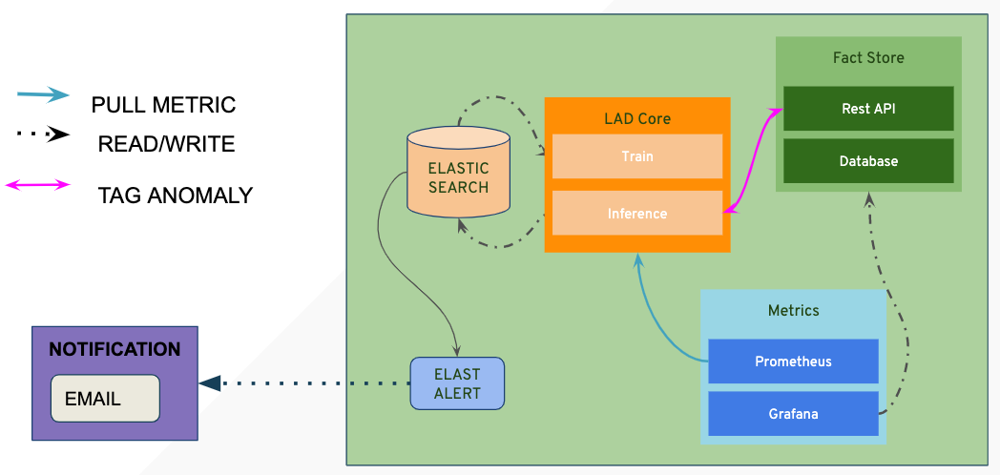

************
Architecture
************

This is a high level overview of the architecture for log anomaly detector which consists of three components.

*Machine Learning (LAD-Core)*

Contains custom code to train model and predict if a log line is an anomaly. We are currently using W2V (word 2 vec) and SOM (self organizing map) with unsupervised machine learning. We are planning to add more models.
*Monitoring (Metrics)*

To monitor this system in production we utilize grafana and prometheus to visualize the health of this machine learning system.

*Feedback Loop (Fact-Store)*

In addition we have a metadata registry for tracking feedback from false_positives in the machine learning system and to providing a method for ML to self correcting false predictions called the "fact-store".

