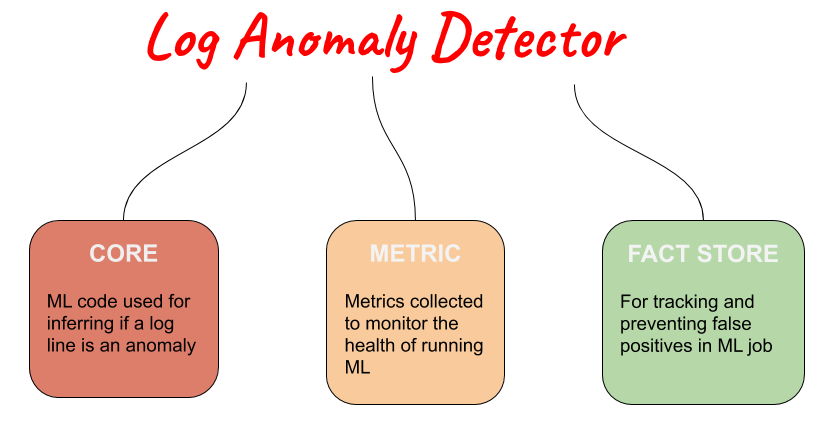

Log Anomaly Detector
====================
Log anomaly detector is an open source project code named "Project Scorpio". LAD is also used for short. It can connect to streaming sources and produce predictions of abnormal log lines. Internally it uses unsupervised machine learning. We incorporate a number of machine learning models to achieve this result. In addition it includes a human in the loop feedback system. 

.. image:: ../../imgs/full-app.gif

Project background
==================
The original goal for this project was to develop an automated means of notifying users when problems occur with their applications based on the information contained in their application logs. Unfortunately logs are full of messages that contain warnings or even errors that are safe to ignore, so simple “find-keyword” methods are insufficient . In addition, the number of logs are increasing constantly and no human will, or can, monitor them all. In short, our original aim was to employ natural language processing tools for text encoding and machine learning methods for automated anomaly detection, in an effort to construct a tool that could help developers perform root cause analysis more quickly on failing applications by highlighting the logs most likely to provide insight into the problem or to generate an alert if an application starts to produce a high frequency of anomalous logs.

Components
----------
It currently contains the following components:

1. LAD-Core: Contains custom code to train model and predict if a log line is an anomaly. We are currently use W2V (word 2 vec) and SOM (self organizing map) with unsupervised machine learning. We are planning to add more models.
2. Metrics: To monitor this system in production we utilize grafana and prometheus to visualize the health of this machine learning system.
3. Fact-Store: In addition we have a metadata registry for tracking feedback from false_positives in the machine learning system and to providing a method for ML to self correcting false predictions called the “fact-store”.
	

Community
---------
For help or questions about Log Anomaly Detector usage (e.g. "how do I do X?") then you can open an issue and mark it as question. One of our engineers would be glad to answer.

To report a bug, file a documentation issue, or submit a feature request, please open a GitHub issue.

For release announcements and other discussions, please subscribe to our mailing list (https://groups.google.com/forum/#!members/aiops)  

Major updates will be presented at our AiOps special interest group meeting which is a part of openshift commons

Details: https://commons.openshift.org/events.html#event|ai-ops-sig|939

Contributing
============
We happily welcome contributions to LAD. Please see our contribution guide for details.

.. toctree::
    :caption: Table of Contents
    :name: mastertoc

    installation
    cli
    use_case
    factstore
    Contributing <development_guide>
    configinfo
    metricsinfo
    architecture
    model
    storage
    changelog
