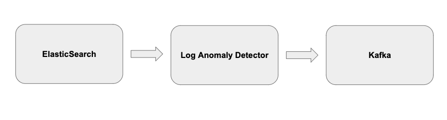

Storage
=======

The following table provides source and sink configuration fields that you can set for your data pipeline

+-------------------------------------+------------------------------+----------------------------+
| Data Source                         | Source                       | Sink                       |
+=====================================+==============================+============================+
| Elasticsearch                       | es                           |  es                        |
+-------------------------------------+------------------------------+----------------------------+
| Local                               | local                        |  local                     |
+-------------------------------------+------------------------------+----------------------------+
| Local Directory                     | localdir                     |                            |
+-------------------------------------+------------------------------+----------------------------+
| Console Output                      |                              |  stdout                    |
+-------------------------------------+------------------------------+----------------------------+
| Kafka                               |                              |  kafka                     |
+-------------------------------------+------------------------------+----------------------------+
 

Example
-------
To read from Elasticsearch and write predictions to Kafka you can use the following configurations

.. code-block:: shell

   STORAGE_DATASOURCE: “es”
   STORAGE_DATASINK: “kafka”

.. Caution::

   We have removed es.source/es.sink entirely and you need to specify "es" instead. See table above.

Storage Details
===============

ElasticSearch
-------------
ES backend is pulling data from ElasticSearch instance. There are some assumptions made about the structure of the data and index names.

Index name is assumed to be in the format of index_name-YYYY.MM.DD, where the date is automatically appended based on current date - i.e. only provide index_name- prefix as a parameter
You index schema has to contain a service field which is used for filtering the input data
_source object in the index entry has to contain message field which then contains string representing the actual stored log message
Results are stored back into ElasticSearch as a copy of the input ElasticSearch index with the addition of two fields that help to identify logs as either anomalous or not for later review by users: anomaly, which is either 0 for false, or a 1 for true. And anomaly_score, a real valued number used to quantify the anomalousness of a log.

Local
-----
Local storage backend is able to read data from a file or standard input and write results back to a file or standard output.

Input data can be in a form of JSON (one entry per line) or plain text (simplified JSON object resembling the ES entry described above is constructed). We also support common logging format ["timestamp  severity    message"]

Stdout
------

You can output anomalies found out on console to allow us to debug without sending emails.

LocalDir
--------
This works the same as the local storage except this will let you read from a directory of logs which can either be json or common log. We support only files ending with '.log' or '.json'

.. note::

   You will need to set the configuration via cli to select which data provider you will use.

Extending Storage
-----------------

You can extend the following storage classes to allow for LAD to connect to different systems:

.. literalinclude:: ../../anomaly_detector/storage/storage_sink.py
.. literalinclude:: ../../anomaly_detector/storage/storage_source.py

Here are git issues that explain how to set something like this up:

See: https://github.com/AICoE/log-anomaly-detector/issues/281 for example of how to add new storage sink

See: https://github.com/AICoE/log-anomaly-detector/issues/207 for example of how to add new storage source

 

