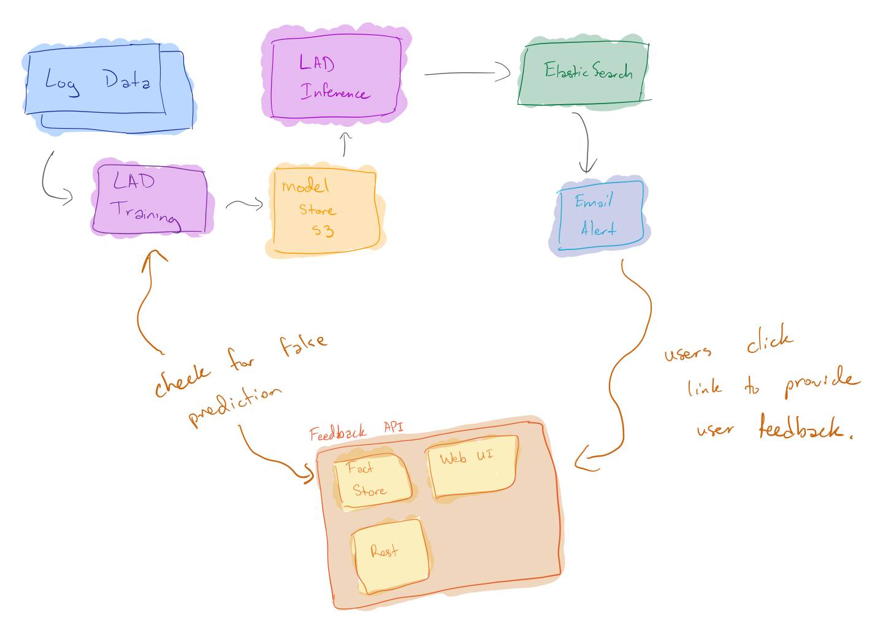

# Fact Store 

## Overview

In this repository we are experimenting with building a userfeedback driven fact store.
 This will be a service that will utilized to query for finding false predictions. 
 Also will allow users to click which anomaly is not really an anomaly for example.

 

### Status

This is in development and not ready for use yet.
