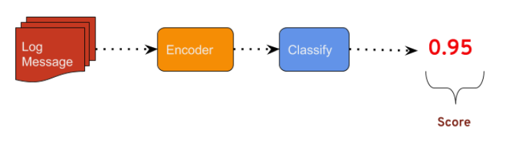

Encoding And Model Inference Specification
==========================================

Purpose
-------
The purpose of this document is to describe the context and current state of the LAD (Log Anomaly Detection) application, and to discuss possible extensions to be explored on an experimental basis.

Introduction
------------
Most of the world's data is unlabeled and when you are working with unlabeled data you will need to use unsupervised machine learning. Log anomaly detection has two main elements that need to be addressed in order to construct a successful model: Text encoding and anomaly classification (see figure 1). Log anomaly detector processes unlabelled log data and performs predictions using two models. Word2Vec which encodes the log messages into meaningful representations and self organizing map which produces a score. The score is then compared against a threshold and if the score is above the threshold it is classified as an anomaly.

Figure 1
--------

Encoding
--------

Since logs are made of text data, we need a method for vectorizing our logs, or converting them into a numerical representation. However, logs are not uniform and can be made up of words, sentences, paragraphs of different lengths and determining the best encoding scheme is not necessarily obvious ahead of time. Element frequency, one-hot encoding,Word2Vec , TF-IDF, Doc2Vec, LDA are all possible choices. But even landing on one, at what level do you encode? Word, sentence or entire log?

Classification
--------------

Once you have a good encoding scheme, you now need to apply an unsupervised learning algorithm to determine the anomalousness of your data. In my opinion this is the simpler of the two problems faced by anomaly detection. Once we have a meaningful document encoding scheme in place, there are many well established unsupervised learning techniques that could be applied.  Some worth exploring are: Self Organizing Maps, K-Nearest Neighbour, PCA, and Invariants Mining among others.

When developing classification models for anomaly detection, there are two ways of quantifying anomalousness: Probability and Distance. 1)  Given some set of features, what is the probability that an example is in the set. Or, 2) how far away is a feature vector in a high-dimensional sense (L1, L2, cosine similarity), from your training set? This quantification is determined by the type of classification you land on.

Example 1, Log Message:
-----------------------
.. code-block:: json

     [ {
    message: "INFO [main] org.apache.hadoop.mapreduce.v2.app.MRAppMaster: Using mapred newApiCommitter."
      }  , {
    message: "INFO [main] org.apache.hadoop.mapreduce.v2.app.MRAppMaster: OutputCommitter set in config null"
      } ]

Problem Statement
-----------------
Anomalies are abnormal behavior in applications it can be a system that usually works but suddenly is failing. For day two operations there are tools to monitor and collect logs however as volume of log data grows, it  can be inefficient  for humans to read them. We have built a system but we want to extend it to provide better accuracy of predictions. The near term goal is to identify anomalies. The long term goal is to have a mechanism to take preemptive action or remediate an issue if an application exhibits abnormal behaviour.

Proposed Solution
-----------------
After careful review we implemented log anomaly detector using word2vec and self organizing map. However there is more work to do. Areas of improvement include using different approaches to understand the logs through NLP techniques such as using doc2vec instead of word2vec or much more powerful representation such as BERT. Then apply predictions through SOM. Auto-encoders is another area we would like to research. If the anomalies are more focused on the occurrence of words then we may want to research using LDA. If the anomalies are more semantic then auto-encoders may be useful.  You are free to use whichever framework/language you would like and we may have labelled datasets in the future but initially we would like to utilize unsupervised ML techniques as our data is unlabelled. Moreover, we would like to have a method to do reinforcement learning on inaccurate predictions. We would like to research the method in which the models can learn from past mistakes.
